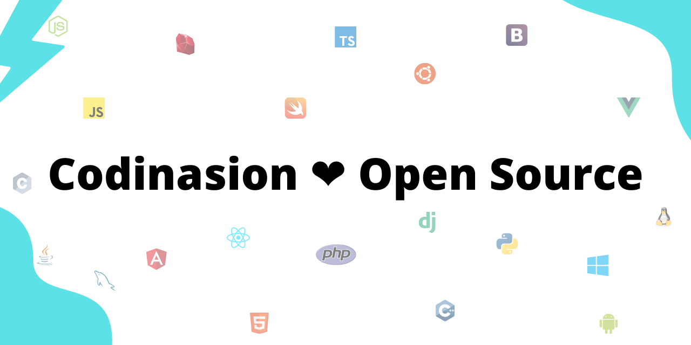
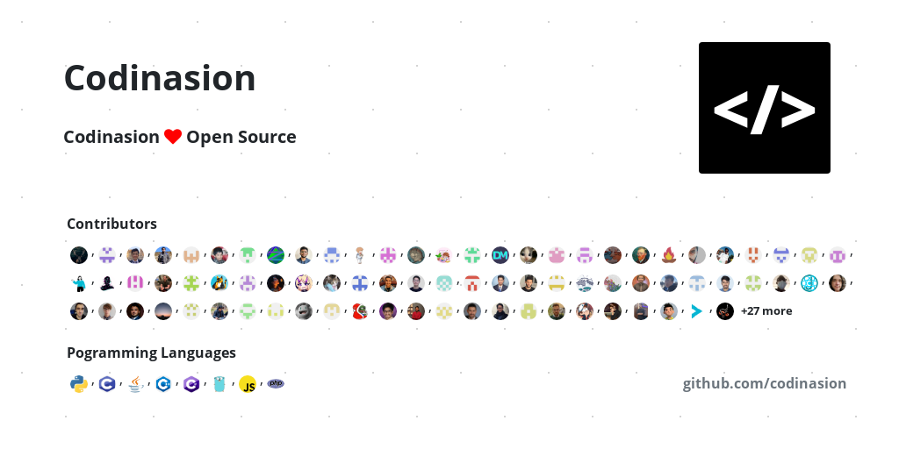
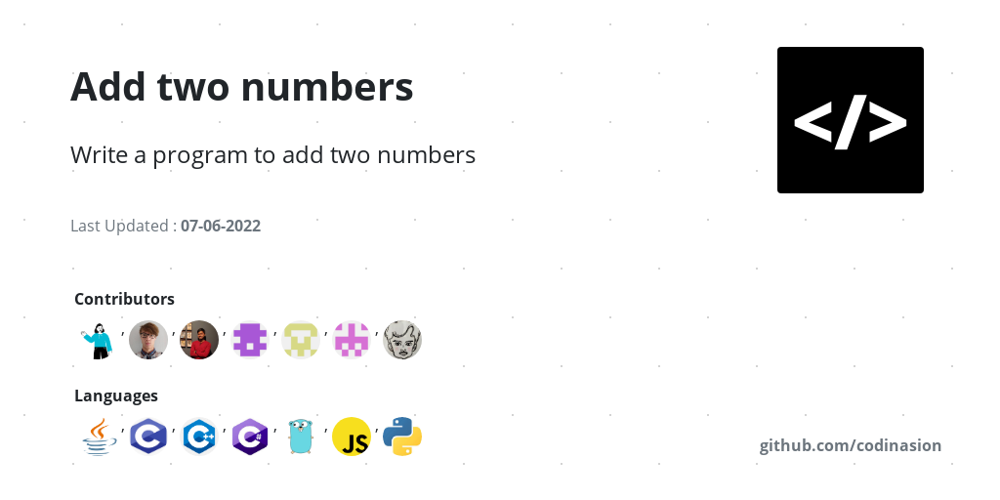
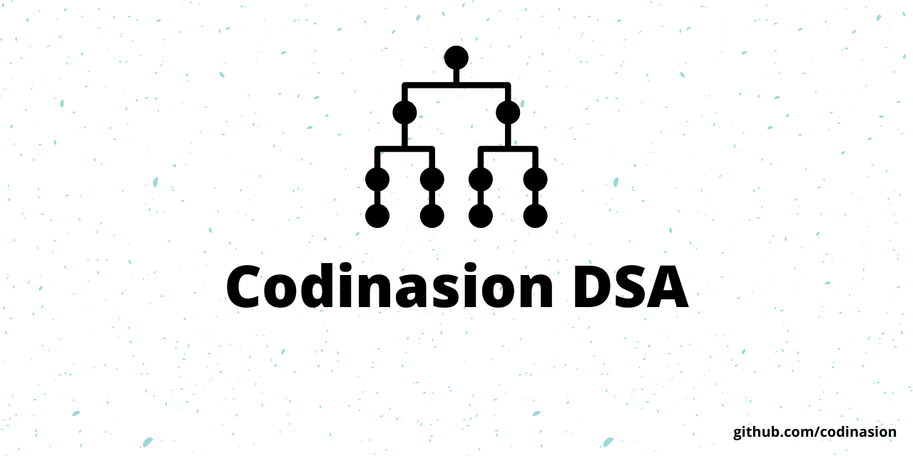
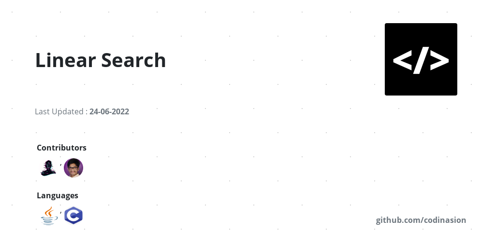

<h2 align="center">Codinasion OG</h2>

<div align="center">

Dynamic OG image generator for Codinasion

[](https://github.com/codinasion/codinasion-og/blob/master/LICENSE.md) [](https://github.com/codinasion/codinasion-og) [](https://github.com/codinasion/codinasion-og/graphs/contributors) [](https://github.com/codinasion/codinasion-og/graphs/commit-activity)

</div>

<div align="center">
  
</div>

### 📝 Table of Contents

- [🧐 About <a name = "about"></a>](#-about-)
- [🏁 Getting Started <a name = "getting_started"></a>](#-getting-started-)
- [✨ Generate OG <a name = "generate_og"></a>](#-generate-og-)
- [🚀 Deployment <a name = "deployment"></a>](#-deployment-)
- [⛏️ Built Using <a name = "built_using"></a>](#️-built-using-)
- [🔗 Reference](#-reference)

<div align="center">
  
</div>

## 🧐 About <a name = "about"></a>

A NEXT JS app to generate OG images for Codinasion website.

<div align="center">
  
</div>

## 🏁 Getting Started <a name = "getting_started"></a>

- Clone project
  ```
  git clone https://github.com/codinasion/codinasion-og
  ```
  ```
  cd codinasion-og/
  ```
- Install packages
  ```
  yarn
  ```
- Setup Environment Variables

  - Rename `.env.example` to `.env`
  <!-- - https://docs.github.com/en/authentication/keeping-your-account-and-data-secure/creating-a-personal-access-token -->
  - Replace `GITHUB_TOKEN=your_personal_access_token` with your personal access token

- Start development server
  ```
  yarn start
  ```
- Open browser and navigate to http://localhost:3000/

<div align="center">
  
</div>

## ✨ Generate OG <a name = "generate_og"></a>

- [Basic Structure](https://codinasion-og.vercel.app/api?url=codinasion_site_url)

  ```md
  https://codinasion-og.vercel.app/api?url=codinasion_site_url
  ```

- [Default OG](https://codinasion-og.vercel.app/api?url=anything)

  ```md
  https://codinasion-og.vercel.app/api?url=anything
  ```

  

- [Homepage OG](https://codinasion-og.vercel.app/api?url=https://codinasion.vercel.app)

  ```md
  https://codinasion-og.vercel.app/api
  ```

  ```md
  https://codinasion-og.vercel.app/api?url=https://codinasion.vercel.app
  ```

  

- [Programme Homepage OG](https://codinasion-og.vercel.app/api?url=https://codinasion.vercel.app/programme)

  ```md
  https://codinasion-og.vercel.app/api?url=https://codinasion.vercel.app/programme
  ```

  

- [Programme OG](https://codinasion-og.vercel.app/api?url=https://codinasion.vercel.app/programme/add-two-numbers)

  ```md
  https://codinasion-og.vercel.app/api?url=https://codinasion.vercel.app/programme/add-two-numbers
  ```

  

- [DSA Homepage OG](https://codinasion-og.vercel.app/api?url=https://codinasion.vercel.app/dsa)

  ```md
  https://codinasion-og.vercel.app/api?url=https://codinasion.vercel.app/dsa
  ```

  

- [DSA OG](https://codinasion-og.vercel.app/api?url=https://codinasion.vercel.app/dsa/linear-search)

  ```md
  https://codinasion-og.vercel.app/api?url=https://codinasion.vercel.app/dsa/linear-search
  ```

  

<div align="center">
  
</div>

## 🚀 Deployment <a name = "deployment"></a>

[](https://vercel.com/new/clone?repository-url=https%3A%2F%2Fgithub.com%2Fcodinasion%2Fcodinasion-og)

<div align="center">
  
</div>

## ⛏️ Built Using <a name = "built_using"></a>

- [Next.js](https://nextjs.org/)
- [React](https://reactjs.org/)
- [Github API](https://developer.github.com/v4/)
- [Chrome AWS Lambda](https://aws.amazon.com/lambda/)
- [Puppeteer](https://puppeteer.dev/)

<div align="center">
  
</div>

## 🔗 Reference

- [Github Blog](https://github.blog/2021-06-22-framework-building-open-graph-images/)
- [Vercel OG Image](https://github.com/vercel/og-image)

<div align="center">
  
</div>

<br>

<table>
  <tr>
    <td>
      
      <h3>Thanks for contributing :purple_heart:</h3>
      <ul>
        <li>Thanks for all your contributions and efforts</li>
        <li>We thank you being part of our :sparkles: commUnity :sparkles: !</li>
      </ul>
      
    </td>
  </tr>
</table>

<div align="center">
  
</div>
